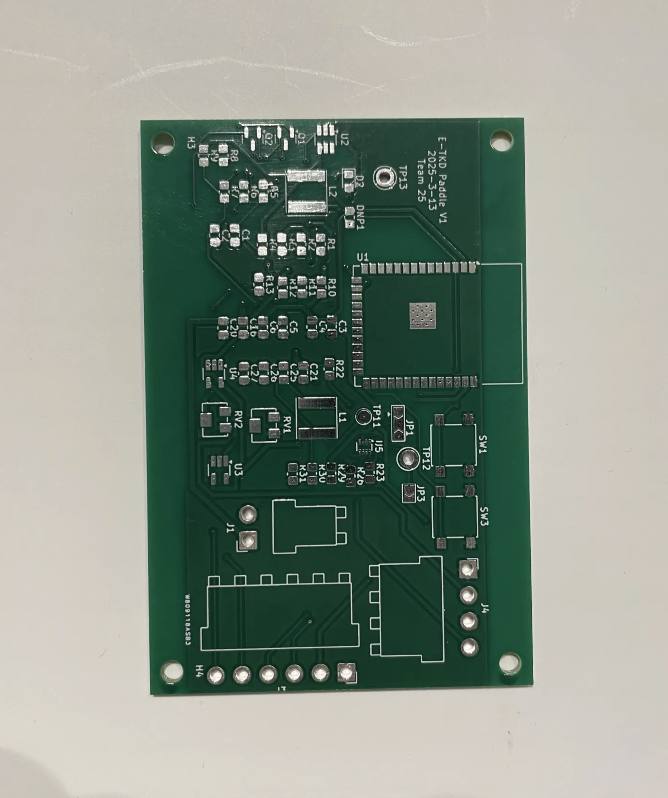
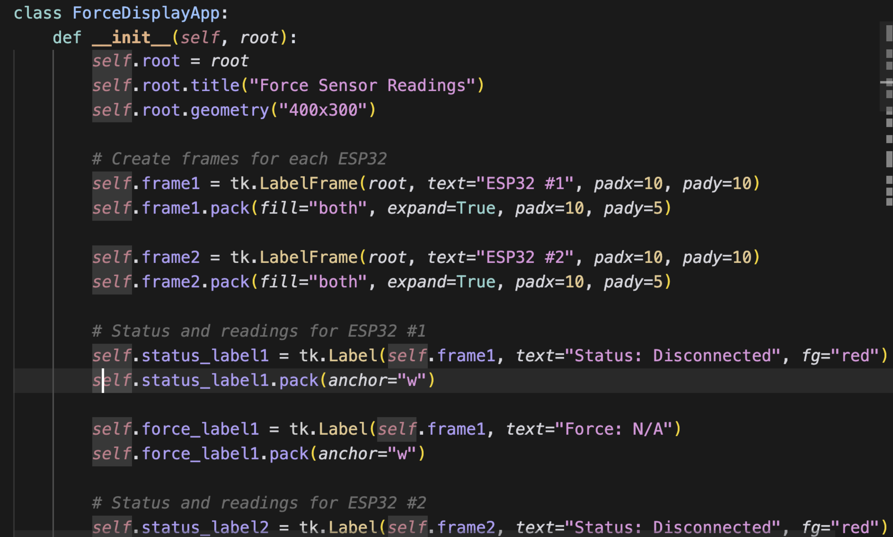
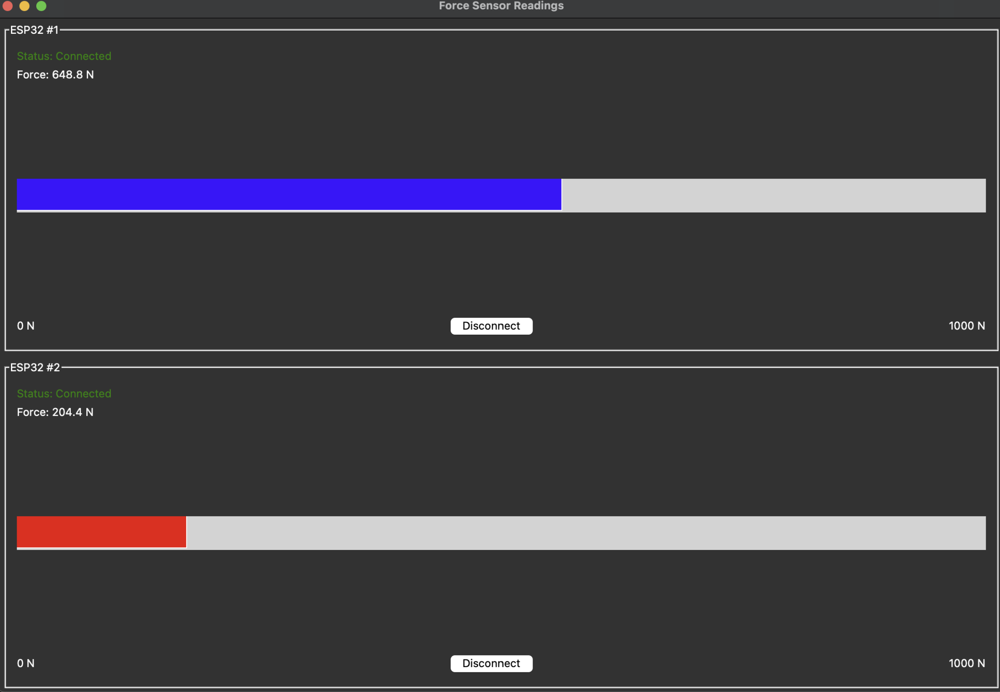

&nbsp;&nbsp;&nbsp;&nbsp; Today we got our PCB order. This is our physical PCB before soldering. We will be soldering componenets very soon, we are waiting for the pieces to arrive.

<figure>
    
    <figcaption style="font-size: 0.7em;">Physcial PCB before soldering components</figcaption>
</figure>

&nbsp;&nbsp;&nbsp;&nbsp; In the meantime, we built the UI for our TKD training regimen program. Once we figure out how to connect it to the ESP, we are going to test the basic funtionality and verify that at least the ESP32 is able to connect. Then we will integrate our force sensors to ensure that force measurements are read on the computer. 

<figure>
    
    <figcaption style="font-size: 0.7em;">Code from our program</figcaption>
</figure>

<figure>
    
    <figcaption style="font-size: 0.7em;">Force measurement UI</figcaption>
</figure>

&nbsp;&nbsp;&nbsp;&nbsp; This is the basic UI for the force measurement reading page. Once we can receive the force readings from the ESP32, it will display on the screen as a meter that gauges how strong the strikes are. 
