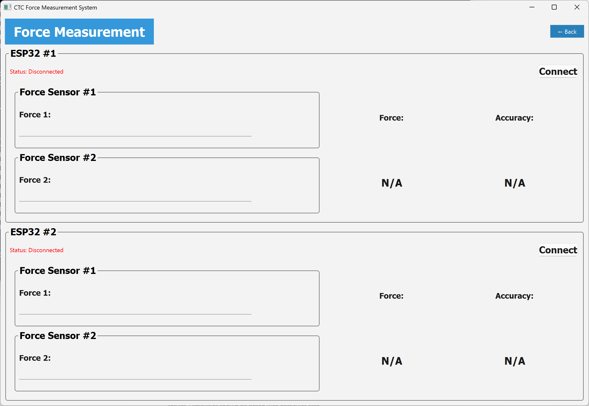

<figure>
    
    <figcaption style="font-size: 0.7em;">Program main menu</figcaption>
</figure>

&nbsp;&nbsp;&nbsp;&nbsp; Today we polished up the program's main menu. We have three categories planned out right now: the first option being the standard force measurement in which athletes are able to visualize and understand their strikes' forces on the paddles in real time. The second option brings you to various training modes, some of which are reaction speed drills, power drills, and etc. The last option is for athletes to have fun or train with other athletes through mini-games. These modes are still in progress. 

<figure>
    
    <figcaption style="font-size: 0.7em;">Force measurement main menu</figcaption>
</figure>

&nbsp;&nbsp;&nbsp;&nbsp; This is the page for the *Standard Force Measurement* feature. We tested that the force measurement are read and received by our program by connecting the ESP32 with a UART to USB connector directly to the computer. We have two sections in this page so that two different paddles each with their ESP32 can connect simultaneously. We are still figuring out the bluetooth communication part of the project. 
