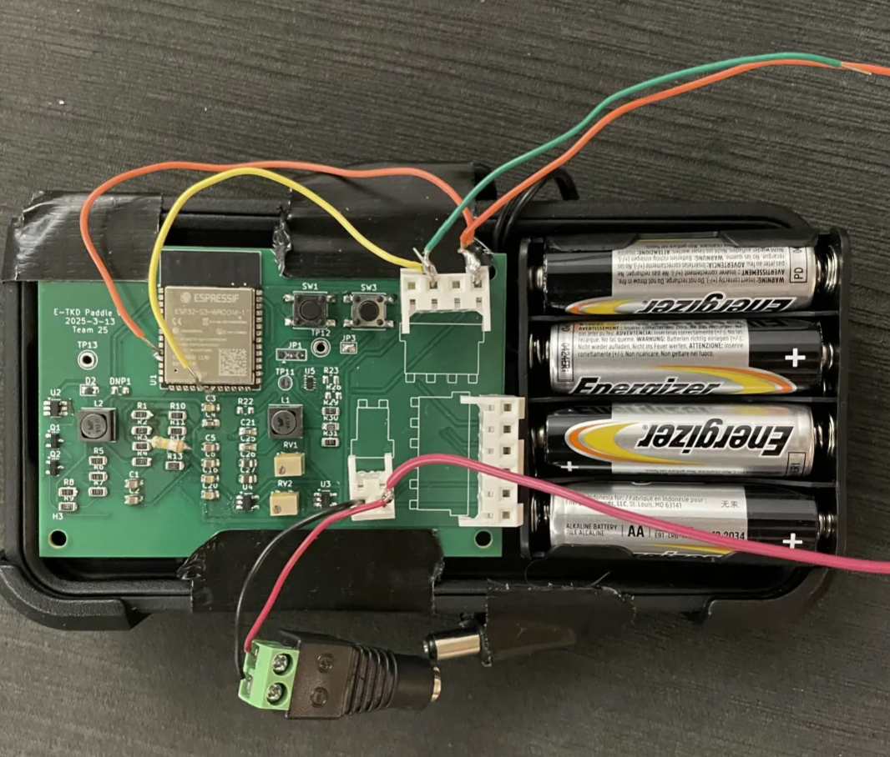
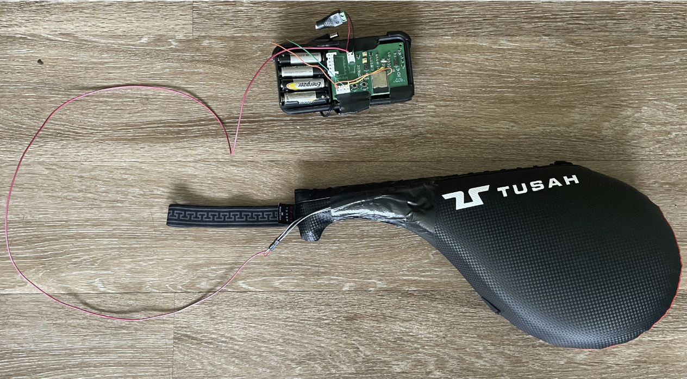

4/25 ~ 27

<figure>
    
    <figcaption style="font-size: 0.7em;">Finished PCB</figcaption>
</figure>

&nbsp;&nbsp;&nbsp;&nbsp; After our most recent checkpoint of driving our PCB with the lab bench power supply at 9V, we tried using a 9V rectangle alkaline battery as a power supply, but something terrible happened. After a couple minutes of doing the same tests as before: making sure the ESP32 connects via bluetooth and the forces are read upon striking, our PCB starting smoking. We immediately unplugged our battery. We used a voltmeter at various test points to make sure our PCB was still ok, but as expected, the battery burned away half of our board. 

&nbsp;&nbsp;&nbsp;&nbsp; This is was extremely frustrating, because our design was working perfectly as intended using the lab bench power supply. We figured that one of the parts, the step converter, was potentially causing us problems. We ordered a replacement step converter initially, because the original one was out of stock. Either it was that or the 9V rectangle alkaline battery is very unreliable. 

&nbsp;&nbsp;&nbsp;&nbsp; In efforts to try to save our PCB, we debugged it at various points by replacing the components and supplying a lower voltage at various other points. But we had no luck. So with only a couple days remaining to the demo, we resoldering and redesigned a whole new PCB and got that to work. Instead of the 9V battery, we used four AA batteries for a total of 6V. This worked just as fine, and we continued wrapping up the project. 

<figure>
    
    <figcaption style="font-size: 0.7em;">Full finished product</figcaption>
</figure>

4/28

&nbsp;&nbsp;&nbsp;&nbsp; Today we demoed our project. It seems like the TAs and the professor liked our project. 

