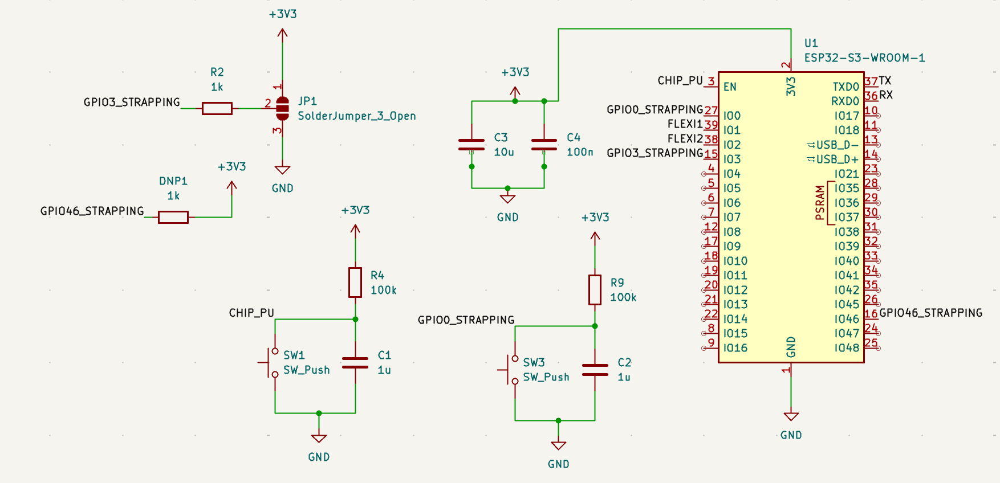
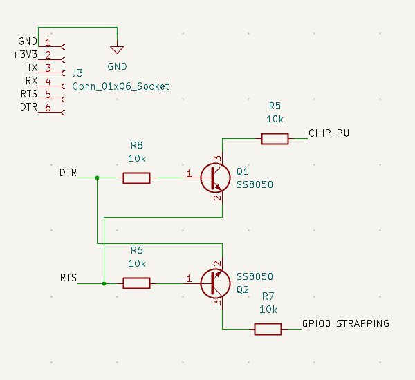

4/6:

We have soldered almost all of the parts to our board, except for a few resistors and capacitors that the supply center and self service didn't end up having. 

We have gotten our paddle back from the machine shop and have our sensors ready to wire to our board. 

4/13:

we have successfully programmed our board, and we are able to read from it as well. All of our tests up until this point have passed. 

We are now waiting for our finals parts and will be able to test the full functionality of the baord. 

4/20:

We have recieved most of our parts and soldered them to our board. We are able to successfully power with 9V from the bench supply and get the correct readings on our board. We are properly sending 3.3V to the esp32. 

We will be building a second board to demonstrate the functionality with two padles. 

We have gotten our paddles back and will start threading the sensors through to connect them, after we test them on our board.

We successfully tested our sensors on our board, however the readings were very low. We are able to see changes when we tap the sensors, however we don't have a screwdriver small enough to actually change the potentiometers to increase the sensitivity. 

4/27:

our 9V battery did in fact burn our first board. 

We had to make a last minute change to use 6 volts instead, because apparently trhe 9V block battery is unreliable and we don't know why it burnt our board. 

We are using 4 AA batteries in series to supply 6 volts to our board, which it should be able to handle just fine.

After testing, using the 4 AA batteries works just fine so thankfully we have our second board which we are able to use since the first one burnt.

We tried replacing the pieces we think were affected however still no luck getting the first board to work so we may just have to demo one board. We can still show that two boards are able to connect by programming one of them, connecting it, then reprogramming it with a different ID, and connecting it as well. 

We have gotten our second board working and hooked up to the paddle successfully! 

We have demoed successfully, showing the consistency of the force readings, successful speed readings, and showing successful accuracy readings as well. 

