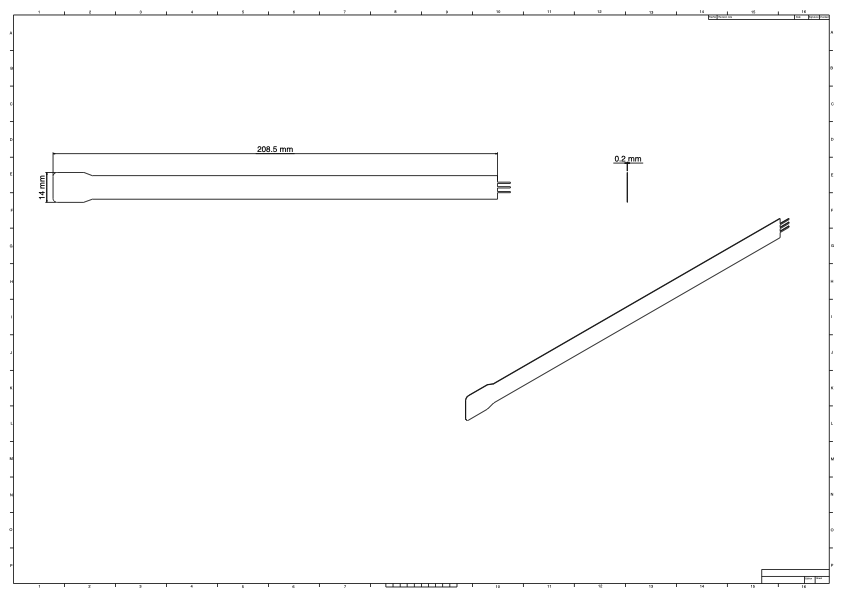

3/3

We have ordered our main parts:

ESP32-S3-WROOM
(Dual‑core, integrated WiFi/Bluetooth; handles sensor data, LED control, and wireless communication to the control box.)

Force Sensors:
8″ FlexiForce 0‑100lb Resistive Force Sensor (id: 3102_0)
(Include appropriate mounting and a padded interface to distribute impact and protect the sensor.)

We have also requested other small components from the ECEB. 

Today we are ordering more parts necessary for us to set up our breadboard demo. as well as any other parts that cannot be obtained through the ECE building such as our bluetooth module. 

We have found that most of our simpler parts we can get for free such as our voltage regulators, power supplies, resistors and capacitors etc. 

The FlexiForce sensor documentation. Here are the recommended circuit diagrams and sensor dimensions:

The recommended circuit uses an MCP 6001 op-amp with a reference resistance between 1kΩ to 100kΩ. The sensor resistance at no load is >5MΩ, and the maximum recommended current is 2.5mA. This will be important for our circuit design when integrating the sensor with our ESP32.

