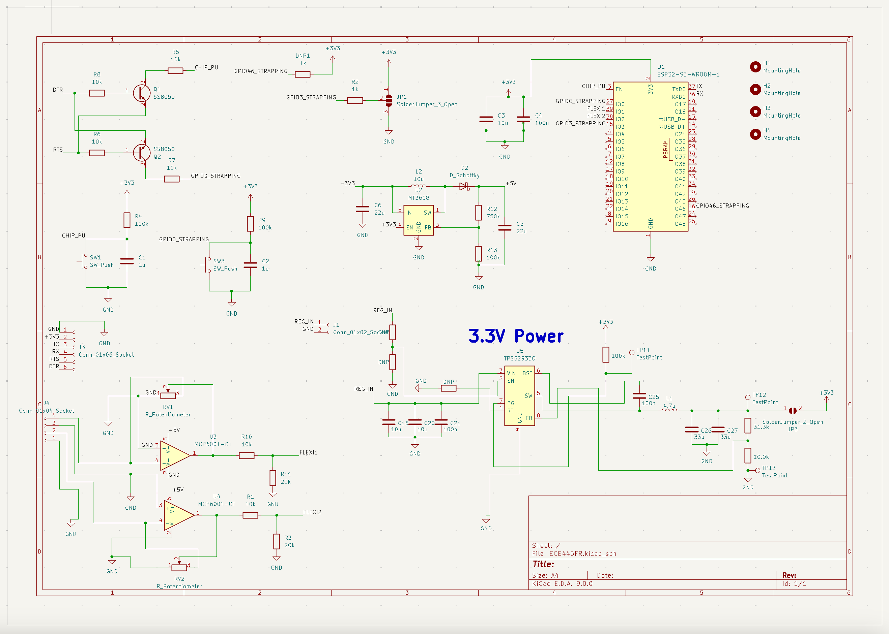
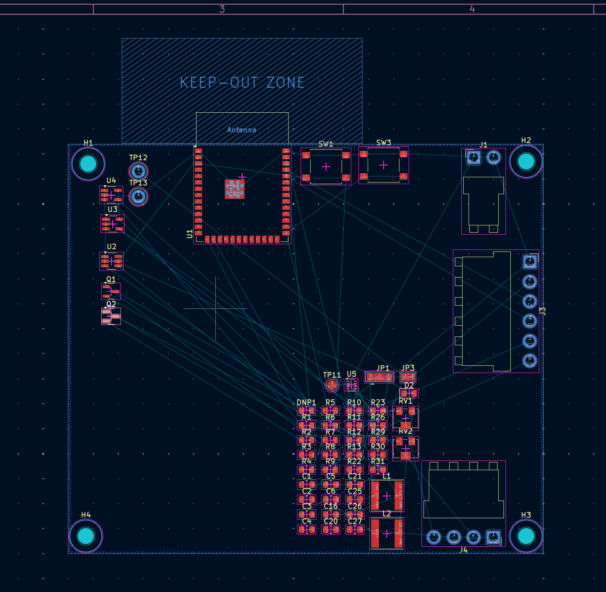
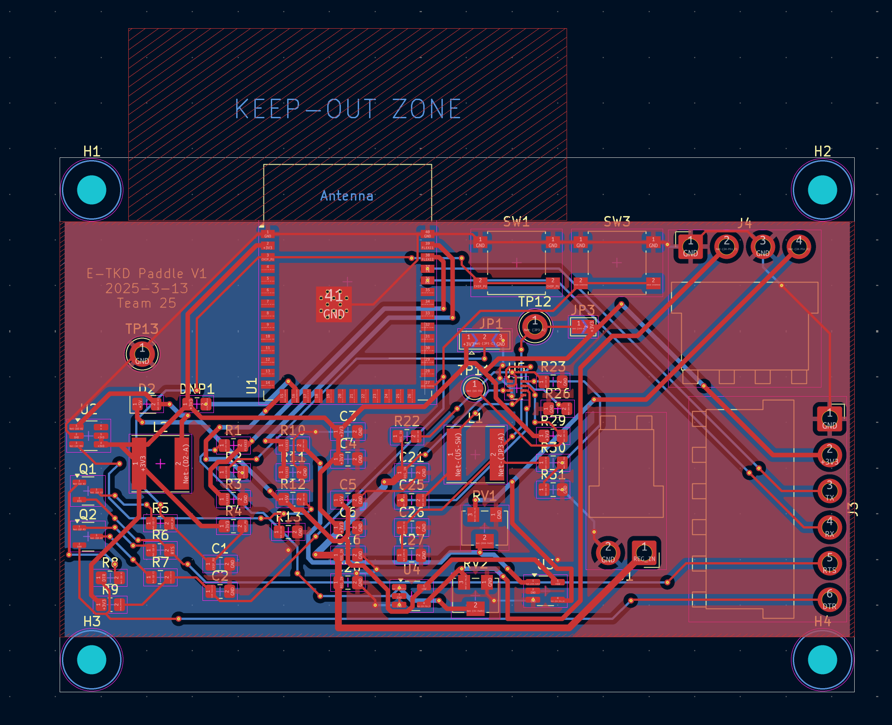
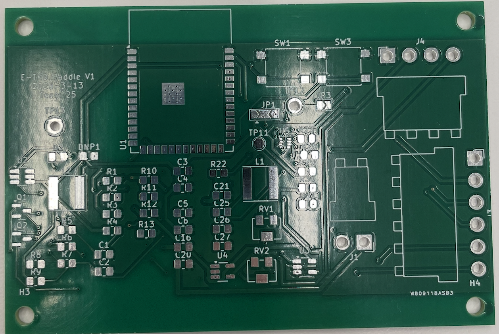

3/3

We have ordered our main parts:

ESP32-S3-WROOM
(Dual‑core, integrated WiFi/Bluetooth; handles sensor data, LED control, and wireless communication to the control box.)

Force Sensors:
8″ FlexiForce 0‑100lb Resistive Force Sensor (id: 3102_0)
(Include appropriate mounting and a padded interface to distribute impact and protect the sensor.)

We have also requested other small components from the ECEB. 

Today we are ordering more parts necessary for us to set up our breadboard demo. as well as any other parts that cannot be obtained through the ECE building such as our bluetooth module. 

We have found that most of our simpler parts we can get for free such as our voltage regulators, power supplies, resistors and capacitors etc. 

The FlexiForce sensor documentation. Here are the recommended circuit diagrams and sensor dimensions:

The recommended circuit uses an MCP 6001 op-amp with a reference resistance between 1kΩ to 100kΩ. The sensor resistance at no load is >5MΩ, and the maximum recommended current is 2.5mA. This will be important for our circuit design when integrating the sensor with our ESP32.

Final breadboard demo board:

3/10

We have decided to do a significant redesign to our project. We are removing the control box functionality and are instead using just a laptop in place.

We are doing this because it will be significantly easier for the user, and we are then able to handle a more complex program and display, as well as multiple paddles being used in conjunction

We have finalized our PCB schematic and design, and have routed all of our connections. We have added a few test points and gone through both PCBways audit, as well as the design rule checker in KiCad

There were some issues initially, some with hole sized being too small, an issue with the esp32 footprint not matching, and then an issue with our potentiometer design that Alex found.

In our design we give room for two flexiforce resistors, they are to be connected via wires to the board rather than connected directly. This allows us much more flexibility in the placement of our sensors. 

3/17

We have passed all audits and ordered from PCBway. It should be arriving Wednesday or Thursday. 

Our actual PCB

3/24

We started working on our program to connect multiple esp32's to a laptop. 

We have also ordered the parts necessary for us to start testing our board and we will be able to do that next week. 

We have Started our final design for the paddle to give to the machine shop. 

3/31

We will be soldering the esp32 onto our boards this week and connecting the flexiforce resistors so that we can test the pcbs. Then we will also be able to connect them to our program.

If we are able to test the pcb properly then we will solder the rest of the components.

